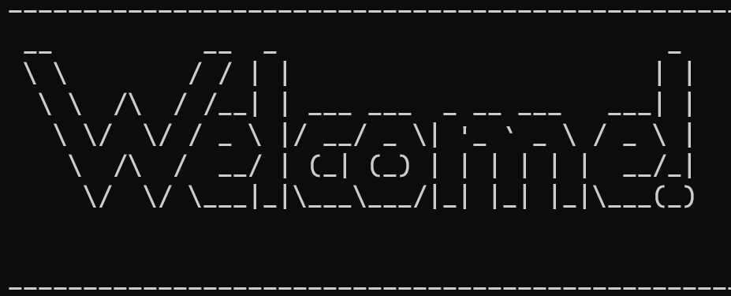

# Computer Student Simulator 🧑‍💻
 

## About this game🎮

Inspired by the daily life of a computer system technology student at school, Computer Student Simulator is created. 
The goal of the character (student) is to gain enough knowledge and to reach Term 4. Ace an interview and secure a job.

immerse yourself in this journey, be expected to encounter surprise challenges along the way!
Your ultimate goal is to reach Term 4, ace an interview, and secure a job.

## Overview 👀

Player can navigate through a virtual 2D map, be expected to encounter surprise challenges along the way!
You may encounter Leetcode questions ,and you will have to solve them. 
Successfully answering a question will reward you with valuable knowledge, essential for advancing to higher terms 
and graduate. 

To get an interview, gather enough knowledge and head to the bottom right corner of the map. 
Your success in the interview may lead to a job offer. However, be mindful of your stress level. 
If it surpasses 50, your character will pass out, bringing the game to an end. 
Need a break? Visit home to reduce stress.

## Getting Started 📦

To start the adventure, execute the `game.py` file. This is the entry point for the game.

In the `text` folder, you will find the external text files. 
Spoiler alert, don't open the text files after playing the game.

In the `test` folder, you will find all the unittests for functions. 
This game has been thoroughly tested to minimize potential errors.

## Contents of folder 📁

    COMP1510TermProject/
    |
    |-- __init__.py
    |-- game.py
    |-- README.md
    |
    |-- game_resources/
    |   |-- advance.py
    |   |-- all_events.py
    |   |-- end_game.py
    |   |-- initialize_game.py
    |   |-- load_game.py
    |   |-- move.py
    |
    |-- text/
    |   |-- game_end1.txt
    |   |-- game_end2.txt
    |   |-- advance.txt
    |   |-- cat.txt
    |   |-- interview.txt
    |   |-- intro.txt
    |-- test/
    |   |-- test_advance.py
    |   |-- test_character_advance.py
    |   |-- test_conduct_interview.py
    |   |-- test_describe_current_location.py
    |   |-- test_display_map.py
    |   |-- test_encounter_event.py
    |   |-- test_end_of_game.py
    |   |-- test_event.py
    |   |-- test_game_difficulty.py
    |   |-- test_get_user_choice.py
    |   |-- test_handle_unsuccessful_candidate.py
    |   |-- test_home.py
    |   |-- test_make_board.py
    |   |-- test_move_character.py
    |   |-- test_validate_move.py

